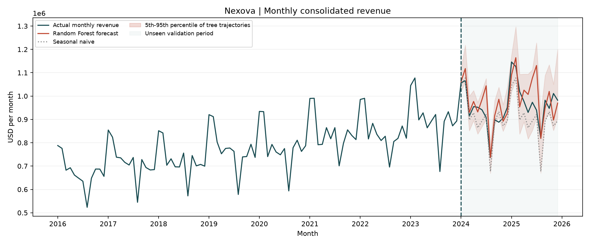

# Pronostico mensual de ingresos | Nexova

## Resumen ejecutivo

En la comprobacion fuera de muestra de enero de 2024 a diciembre de 2025, Random Forest obtuvo un error absoluto medio de **52.532 USD por mes** (aproximadamente **5,5 %** de los ingresos medios reales del periodo, 959.363 USD/mes). La referencia estacional sin aprendizaje obtuvo **57.329 USD/mes**: la mejora del bosque es de unos **4.797 USD/mes (8,4 %)**. La prediccion sobrestimo los ingresos en promedio en **24.283 USD/mes**. Es util como escenario orientativo, pero la ventaja sobre una regla sencilla es reducida: no es suficientemente fiable como unico soporte para compromisos presupuestarios ajustados.

## Datos y preparacion

Se usan las 120 observaciones mensuales de `data/raw/nexova_sales.csv` correspondientes a `business_line=consolidated`, entre enero de 2016 y diciembre de 2025. No hay meses duplicados o ausentes, ni ingresos vacios o no positivos (rango observado: 523.341-1.145.989 USD). En entrenamiento, agosto representa aproximadamente el 78 % del ingreso mensual medio y enero-febrero el 117 %. Los crecimientos interanuales observados oscilan entre -7,8 % y 18,1 % en entrenamiento y entre -4,8 % y 11,7 % en validacion; son fluctuaciones relevantes, no motivos para eliminar filas. No se imputaron ni recortaron valores.

Solo se usan mes del calendario y el cociente entre la media de los ultimos 3 meses y la de los ultimos 12 meses conocidos, como senal de dinamica reciente. El objetivo es crecimiento interanual, no ingresos absolutos. Se excluyen `active_contracts` y `avg_contract_value_usd` del mes predicho porque no estarian disponibles antes de ese mes y podrian revelar directamente los ingresos; no hay promociones, campanas ni festivos registrados. Tampoco se usa `business_line` como feature porque todas las filas disponibles son consolidadas.

## Evaluacion temporal

Se entreno exclusivamente con enero de 2016-diciembre de 2023 (96 meses; 84 objetivos con rezago de 12 meses). Enero de 2024-diciembre de 2025 (24 meses) quedo intacto hasta calcular las metricas. Random Forest usa 300 arboles, hoja minima de 2 observaciones y semilla fija 42, sin busqueda de hiperparametros ni recalibracion con validacion. Cada prediccion usa ingresos historicos o predicciones anteriores, nunca ingresos reales del periodo reservado. La referencia repite los ultimos 12 ingresos de entrenamiento durante los dos anos siguientes, sin consultar las ventas reales del periodo de prueba.

El rango sombreado corresponde a los percentiles 5 y 95 de trayectorias recursivas de los arboles. Contuvo **23 de 24 meses (96 %)** en esta comprobacion, pero **no es un intervalo de confianza calibrado**: la dispersion entre arboles no incorpora cambios de regimen, incertidumbre sobre datos ni todos los errores futuros. Un unico bloque de prueba tampoco permite prometer esa cobertura para los proximos meses.

## Decision y riesgos

La estacionalidad simple es visible, pero hay tendencia de crecimiento y variaciones anuales; Random Forest modela crecimiento interanual precisamente porque no extrapola niveles por si solo. Las desviaciones mensuales, el sesgo al alza y la mejora modesta frente a la referencia obligan a usar colchones de riesgo en lugar de una cifra puntual. Cambios estructurales, promociones, demanda atipica o cambios en el mix de negocio no estan representados en las variables. Antes de presupuestar con un margen de riesgo comprometido, harian falta mas senales disponibles por adelantado y varias evaluaciones temporales adicionales dentro del historico, con intervalos calibrados sin tocar la comprobacion final.

Reproduccion desde la raiz: `uv run --no-project --with pandas --with scikit-learn --with matplotlib python scripts/sales_forecast.py`. La salida es `audit/sales_forecast.png` y las metricas se imprimen en consola.