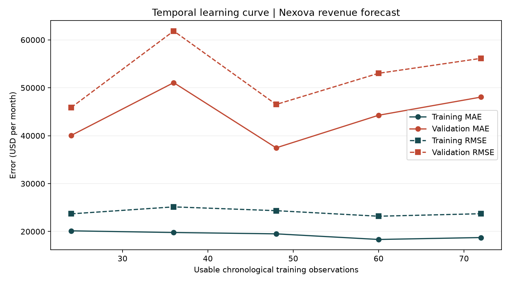

# Evaluacion temporal del pronostico de ingresos

## Alcance y datos

Se evalua `RandomForestRegressor` sobre la serie consolidada mensual de `data/raw/nexova_sales.csv`, filtrada por `business_line == "consolidated"` y usando `month` y `revenue_usd` en USD. El desarrollo comprende enero de 2016 a diciembre de 2023. El holdout final de enero de 2024 a diciembre de 2025 se mantiene separado y no participa en folds, ajuste ni diagnostico.

Las features son mes calendario y `recent_vs_year`, calculada con ingresos de meses anteriores; el objetivo es el crecimiento interanual de `revenue_usd`. No se incluyen campos contemporaneos cuya disponibilidad previa no este demostrada. El modelo conserva 300 arboles, `min_samples_leaf=2` y `random_state=42`; no se ajustan transformaciones fuera de cada fold.

## Metodologia temporal

Se usa expanding-window con cinco bloques cronologicos de 12 meses, sin barajado. Cada modelo se ajusta solo con su prefijo anterior; cada bloque se pronostica recursivamente, incorporando las predicciones previas del propio bloque y nunca sus ingresos reales. El primer origen exige 36 meses de historia y deja 24 observaciones utilizables tras los rezagos. La tabla especifica el intervalo exacto de entrenamiento y validacion de cada fold.

| Fold | Train period | Validation period | Train months | Validation months | Train MAE | Train RMSE | Validation MAE | Validation RMSE |
|---:|---|---|---:|---:|---:|---:|---:|---:|
| 1 | 2016-01 to 2018-12 | 2019-01 to 2019-12 | 36 | 12 | $20,136.99 | $23,685.98 | $40,062.57 | $45,895.81 |
| 2 | 2016-01 to 2019-12 | 2020-01 to 2020-12 | 48 | 12 | $19,790.05 | $25,137.98 | $51,077.20 | $61,861.89 |
| 3 | 2016-01 to 2020-12 | 2021-01 to 2021-12 | 60 | 12 | $19,508.39 | $24,348.42 | $37,467.32 | $46,519.89 |
| 4 | 2016-01 to 2021-12 | 2022-01 to 2022-12 | 72 | 12 | $18,335.20 | $23,187.57 | $44,267.17 | $53,028.81 |
| 5 | 2016-01 to 2022-12 | 2023-01 to 2023-12 | 84 | 12 | $18,735.96 | $23,710.31 | $48,065.53 | $56,150.21 |

Media de validacion ± desviacion estandar muestral (`ddof=1`): MAE $44,187.96 ± $5,583.22/mes; RMSE $52,691.32 ± $6,716.45/mes.

## Curva y diagnostico

**Clasificacion: overfitting.** La brecha MAE entrenamiento-validacion es positiva en todos los folds y su media supera la desviacion entre folds. La curva debe leerse junto con la variabilidad de validacion entre los cinco folds; no se usa el holdout para escoger ni justificar esta conclusion.

MAE es la metrica principal porque expresa el error absoluto mensual tipico directamente en USD para Finanzas. RMSE se conserva como complemento: penaliza mas los errores grandes y hace visible el riesgo de desviaciones severas. No se presupone un costo asimetrico entre sobrestimacion y subestimacion.

Accion: Probar hojas mas grandes o limitar la profundidad y reevaluar exclusivamente en estos folds internos.

## Limitaciones y reproduccion

Cinco bloques anuales ofrecen una muestra limitada de origenes y no cubren cambios futuros de regimen; las features disponibles tampoco incorporan variables empresariales anticipadas. No se modifico el holdout ni se buscaron hiperparametros. Desde la raiz, ejecutar `uv run --no-project --with pandas --with scikit-learn --with matplotlib python scripts/sales_forecast.py --evaluate-cv`; las pruebas focalizadas se ejecutan con `uv run --no-project --with pandas --with scikit-learn --with matplotlib --with pytest pytest tests/pipelines/test_sales_forecast.py -q`.
